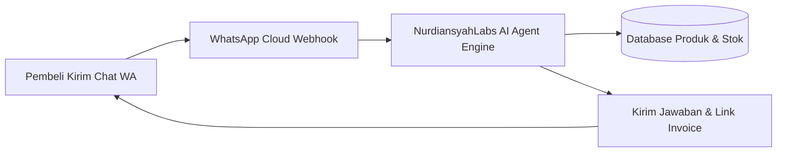

# Integrasi AI Agent & WhatsApp Bot untuk Otomasi CS Toko Online: Panduan 2026

> **Slug:** `integrasi-ai-agent-whatsapp-bot-umkm`  
> **Layanan:** Fullstack Web / Custom Software Development (Service B)  
> **Target Pasar:** Toko Online, UMKM, dan Bisnis Jasa di Indonesia  

---

## Mengapa WhatsApp Bot AI Menjadi Game Changer di 2026?

Di Indonesia, lebih dari **85% transaksi bisnis lokal dan UMKM terjadi melalui WhatsApp**. Namun, kendala terbesar pemilik toko adalah:
1. **Chat menumpuk di luar jam kerja (malam hari):** Calon pembeli bertanya pukul 21.00, baru dibalas esok pagi pukul 09.00. Hasilnya? Pembeli sudah pindah ke kompetitor.
2. **Biaya admin CS membengkak:** Menggaji 2-3 staf admin untuk shift malam memakan biaya jutaan rupiah setiap bulan.
3. **Jawaban manual yang lambat:** Menjawab pertanyaan berulang seperti *"Ready warna apa?", "Ongkir ke Surabaya berapa?", "Format order gimana?"* menghabiskan 70% waktu produktif tim Anda.

Dengan memanfaatkan integrasi **AI Agent modern (LLM)** yang disambungkan ke API WhatsApp dan database inventaris toko, bisnis Anda dapat melayani ribuan pelanggan secara otomatis, 24/7, dengan gaya bahasa ramah manusia.

---

## Cara Kerja Sistem: Dari Chat Pembeli Sampai Transaksi Selesai

1. **Natural Language Understanding:** AI memahami bahasa gaul, typo, maupun singkatan bahasa Indonesia (seperti *"min, msh ad gk yg wrna item?"*).
2. **Koneksi Real-time ke Database:** AI tidak berhalusinasi—ia membaca database produk Anda untuk memastikan ketersediaan barang sebelum menjawab *"Stok tersedia kak!"*.
3. **Eskalasi ke Manusia:** Jika ada komplain berat atau pertanyaan yang butuh penanganan khusus, bot secara otomatis meneruskan chat ke staf admin Anda.

---

## 3 Keunggulan Membangun Bot Kustom vs Menggunakan Aplikasi Pihak Ketiga

Banyak pebisnis tergoda menggunakan platform bot luar negeri, namun berakhir kecewa karena:
* **Tarif Berlangganan Dolar:** Biaya per bulan $50–$200 yang terus naik dan membebani cashflow.
* **Fitur Terbatas & Kaku:** Tidak bisa disambungkan ke sistem kasir (POS) lokal atau metode pembayaran QRIS/BCA/Mandiri.
* **Data Pelanggan Tidak Aman:** Data nomor telepon pembeli Anda tersimpan di server pihak ketiga.

Dengan membangun **Sistem Kustom bersama NurdiansyahLabs**, Anda memiliki kode dan data 100% milik Anda sendiri, tanpa biaya langganan bulanan yang mencekik.

---

## Bagaimana NurdiansyahLabs Membantu Bisnis Anda?

Kami di **NurdiansyahLabs** spesialis dalam rekayasa sistem Fullstack dan integrasi API. Kami menyediakan layanan pembuatan WhatsApp Bot AI siap pakai untuk bisnis Anda:

✅ **Setup Server & Webhook WhatsApp Cloud API Resmi**  
✅ **Integrasi Database Produk & Sistem Kasir Anda**  
✅ **Prompt Engineering Khusus Karakter Brand Anda**  
✅ **Dashboard Admin untuk Memantau Chat & Riwayat Transaksi**  

---

### 💡 Ingin Meningkatkan Omzet Toko Anda dengan Otomasi AI?

Konsultasikan alur toko Anda sekarang juga. Kami berikan analisis kebutuhan teknis dan estimasi biaya secara transparan.

👉 [Klik di Sini untuk Konsultasi Gratis via WhatsApp (0821-7601-2461)](https://wa.me/6282176012461?text=Halo%20NurdiansyahLabs,%20saya%20tertarik%20dengan%20layanan%20integrasi%20WhatsApp%20Bot%20AI%20untuk%20toko%20saya)
